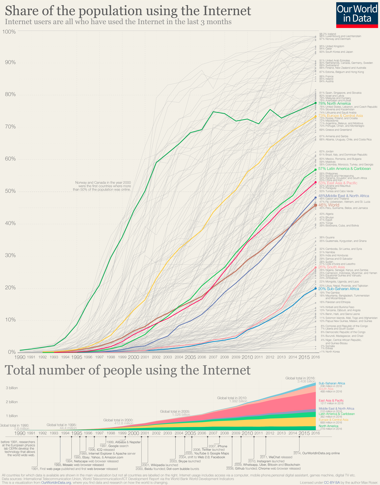
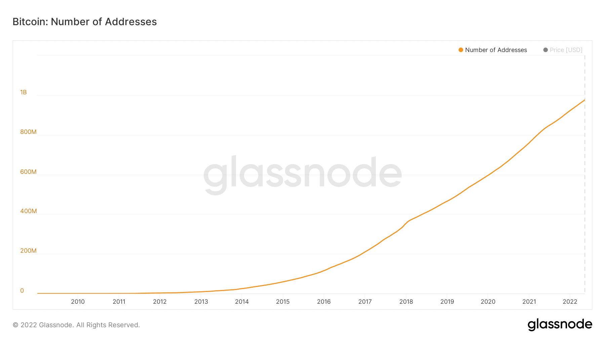
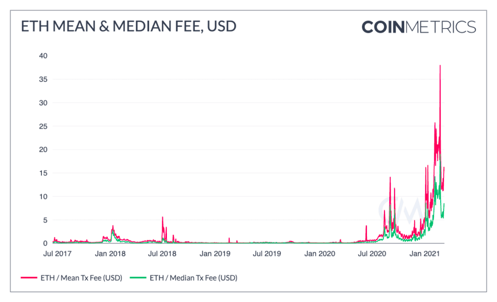

---
tags:
  - crypto
  - history
  - opinion
date: 2022-06-11
publish: true
image: images/history-rhymes/netscape.png
slug: history-rhymes
origin: https://mirror.xyz/fakhoury.eth/w-lp0GNww9Ere8py64M2wI18PD9aEKQjUEL20pzq_mU
description: Parallels between early internet and crypto show growing adoption will lead to a significant future impact on society.
title: History Rhymes, In Defense Of Crypto
---
_TLDR; Crypto doesn’t matter until it does._

> “what if all the layer 1's and eth died tomorrow
> 
> would anyone care?”

I saw this question floated around in a group chat and was surprised by my kneejerk reaction: “of course people would care!”

But there is plenty of truth in the demise of smart contract platforms not affecting the real world. Airplanes would continue flying, grocery stores would still sell food, businesses would keep conducting business, and people would keep living without a hiccup. It’s the truth at the moment. The only effect would be loss of paper wealth.

But, there is a trap here: one of linear thinking. To see why this is _likely_ the case that crypto is an exponential technology regarding its real-world importance, let’s look at the analogy to the internet.

Harkening back to the primordial days (c. the 1980s-1995), it’s easy to find endless recounts of how the internet appeared to most as just a toy, albeit a confusing one at best. Things started to shift in 1995 when the first web browser, Netscape, went public. This was more than 10 whole years after TCP/IP, the defining technology of the web, was invented. Yet, most looked at it and would’ve said “_what if the web browser died tomorrow, would anyone care?_“

At that time, the web browser was used to read horribly plain pieces of text, something that had plenty of alternatives should the technology of the world wide web disappear. This was compounded by the relative friction needed to even get online and the slow speeds for loading a page. Marc Andreesen himself admits this.

Fast forward 5 more years to the height of the dotcom boom. Tons of businesses were being launched in an attempt to recreate the odd success of the Netscape IPO. These businesses, such as online book stores and search engines, again played folly to the disappearance test. People could still buy books in bookstores and could still look up information in a physical book. But a sore piece of data just was not lining up with this sentiment:

**How could the internet have had so many users in 2000 if people didn’t care whether or not it disappeared?** The logical conclusion is that usage is a leading indicator of societal relevance. Technology gets adopted _before_ it can’t be lived without.

The TCP/IP of crypto is Bitcoin, and it has been roughly 15 years since the network saw its first block. Here’s a chart to see its usage growth:

So, 15 years after its invention, how can there be 1 billion unique addresses that have interacted with bitcoin if it’s just a toy? If it were to disappear tomorrow, would anyone care? I’ll admit for bitcoin, the case is different. It’s just trying to be hard money, and by that nature, anyone using it cares deeply about its existence (as money).

On this same timeline, Ethereum (HTTP of crypto?) is in the dotcom era of its existence. It’s the web browser of digitally native value. Whether or not you believe ETH to be money, the service of selling blockspace is the metric that I believe to be the leading indicator of its societal relevance. And just as the physical world connection & importance of the internet today is less about consumers and more about the industrial application, I think the same analogy can be said of what is something as boring as blockspace (see layer 2 networks to expand on this). To continue drawing our line, here’s the chart that says “how come Ethereum is selling so much blockspace if no one cares if it disappeared tomorrow?”:

This graph is about a year old, unfortunately, but it makes the point clear. There’s plenty of paid usage here for a thing that people don’t care for if it “died tomorrow.” If this dependence continues, it cannot be long (a decade max if looking at web history) before the real world starts to feel the externalities of Ethereum. It’s impossible to say what this dependence will be, but Google does a lot more than simple text search now and Amazon does a lot more than sell books. In the same vein, Ethereum will be a lot more than a casino in the future, and applications on ethereum will be a lot more than a token exchange or lending protocol. To get there, tons of these will need to fail, capital will have to flow, and social perception will have to shift to one of dependence. We’re not there, but look up and see where we’re headed.

### Concluding Thoughts

Admissions:

- Yes, people mostly use crypto right now to make money.
- No, people do not use crypto to make purchases.

Counterfactuals:

- Stablecoins as a remittance and settlement mechanism are excellent and actively being integrated into society.
- Crypto applications are trying to replace their analog counterparts rather than augment them.
- Marc Andreesen said that the biggest mistake with Netscape was not building payments into the browser because it was too hard to overcome.

I think now is the time to be phenomenally bullish on the future of crypto networks, while also taking heed to the fact that 95% of the “stuff” out there will die. In my opinion, it’s not hard to see the things that are headed to the grave at this very moment. Just look at usage as a function of organic demand to pay.

For the more crypto native, my opinion is: I think most alt L1s/independent zones are going to die through heat death -- overpaying for network security in the same token that tries to "differentiate" the network. This is a partial ultimatum to the question first posed at the top: of course, there are things out there that no one cares about. These networks will end up competing against ethereum L2s (see the recent ImmutableX versus Avalanche fight for BAYC). Furthermore, L2s will destroy the alt L1s on unit economics, leaving mostly a long tail of small zones that serve local internet communities. Ethereum dominance as a smart contract layer will continue and grow as a supermajority this decade. Other L1s will compete against L2s on ethereum and will struggle as they slowly lose out on a black swan event basis that exposes risks of lower security networks.

What’s actually going to appear to happen these next few years will be a result of high noise to signal as investors pump cash into irrelevant networks. This will cause continued narrative confusion around all versus a few surviving, but ultimately crypto has come to change the world.