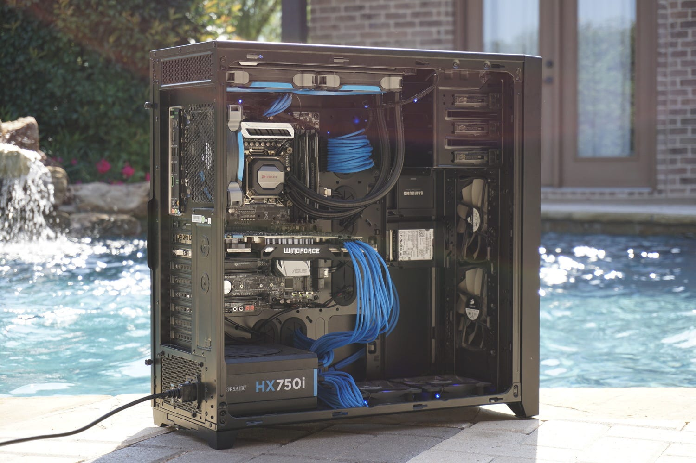

---
tags:
  - pc
  - hardware
date: 2017-05-08
publish: true
image: 
slug: rig
origin: https://medium.com/@brianfakhoury/the-rig-computer-de5bcfb43c38
description: A look at building a custom high-performance PC, featuring an Intel i7, GTX 970, and personal insights on optimizing for power and performance.
title: The Rig (Computer)
---

There exists an industry in electronics that caters to the nerds, is consumer friendly, and can be a hobby. PC’s are inherently customizable because of the modular nature of the components. This characteristic allows for any person to learn how the pieces go together, like a lego set or jigsaw puzzle, and create their own masterpiece. Depending on budget and needs, anyone can create their own computer. So in 2014, I joined this community of custom PC’s. I built a modest Intel i3 system, learned the basics, and learned to enjoy this form of art.

After a year with my trusty, first desktop, I decided to create a new monster. Excuse me while I get technical if you will. For processing power, the Intel i7 chips have four physical cores plus four more hyperthreaded cores. This power, no matter the frequency or architecture, allows for creative tasks ranging from streaming media to editing media to massive algorithmic calculations. Gaming, content production, research (like Stanford’s Folding at Home project) are shown new light with the capabilities of an i7. The chip I chose was of the newest generation extreme edition i7’s, but this is a caveat. Extreme editions, or enthusiast chips, run one architectural generation behind. So going for the i7 5820k was only 4th gen architecture comparable to the mainstream 4790k. Still, the 5820k has six hyperthreaded and (importantly) overclockable cores. Combined with my AIO liquid cooler, I am able to run my chip stable at 4.4 GHz @ 1.315 Volts.

To complement the linear compute power of this i7, and add performance in other areas, I chose nVidia’s GeForce GTX 970. Back in 2015, 3.9 TFLOPS of raw shader compute for less than $400 was amazing (not anymore) and was a great complement for my 5820k. My 970 has an ASIC quality of 75% and runs almost perfect around 1600 MHz!

Here is a complete list of my setup:

PCPartPicker part list: [https://pcpartpicker.com/list/F6j2RG](https://pcpartpicker.com/list/F6j2RG)

Overall, my system falls under a very high end category. The 16GB of RAM will be upgraded eventually along followed by the SSD and video card. While the system pulls around 500W from the wall, I hope that future generations of silicon will allow an even lower power draw for less environmental impact. Anyways, I love all this kind of computer stuff, and this does not include the software and electrical side.
