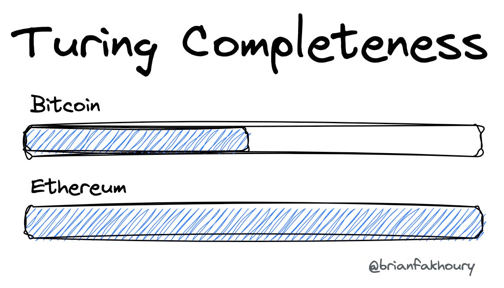
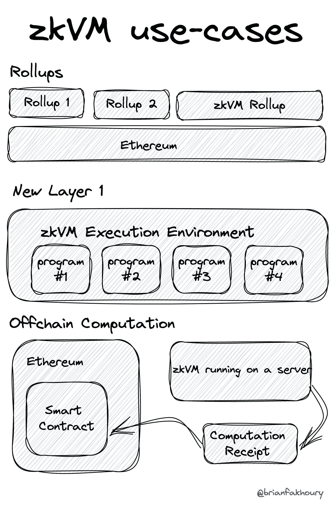

---
tags:
  - crypto
  - zk
  - programming
date: 2022-12-12
publish: true
image: 
slug: zk
origin: https://mirror.xyz/fakhoury.eth/Q4PyoYdOlYGlnAA4q4XWTEk5x5JgFEAhvA9qWvw1PYo
description: Zero-knowledge proofs (ZKPs) enable private, verifiable computations. RISC Zero's zkVM brings this tech to popular programming languages.
---
Zero-knowledge proofs (ZKPs) are an absurd technological breakthrough, and people like [@VitalikButerin](https://twitter.com/VitalikButerin) have publicly commented that they're likely on par with blockchains in terms of ideological importance for this decade. The power of ZKPs can be generally split into two superpowers: privacy & compression. Both sides of this technology are incredibly important, but I want to focus on the compression superpower as it relates to the first line of this thread. How do ZKPs help power compression in a new way?

You can think of using ZKPs for compression like receiving a college degree. The graduation diploma, issued by an "accredited" university, serves as a form of proof (so long as you trust the accreditation). The graduated individual (prover) can convince a third party (of whom might not fully trust the individual) that they've been through years of academic training. Instead of showing the third party dozens of syllabi and exam scores, the diploma serves as a compact proof. We can generalize the diploma in the example to be a "receipt", a general-purpose proof of validity that something happened.

When it comes to computers, ZKPs must be completely math based (no human trust), otherwise, a verifier risks being fooled by a fake proof. The ZKP revolution really kicked off this past decade with narrow applications (in blockchains) for things such as proving you've committed to a number within some allowed range without having to reveal it, and more recently being used to rollup transactions onto Ethereum. Importantly, every zero-knowledge proof system defines its own miniature language in the form of circuits. Therefore, we can think of ZKPs themselves as virtual computers (similar to high-level language interpreters, smart contract platforms, operating system emulators, etc). To make an analogy: Bitcoin was a narrow application of a crypto network, while Ethereum is a fully programmable instance of a crypto network. Some might be familiar with this property as being "Turing complete."

In this same way, ZKPs have only recently had "languages" that are fully expressive. While this is a great property to have, these languages aren't created equal. Ethereum's computer language for example is fairly mature, but not popular outside blockchains. Just like human programmers have preferred languages (JS, Python, Rust, etc...), computers themselves have a most common language that these high-level languages compile into. If we think about ZKPs as virtual computers, then it's important to analyze the proof system language in relation to the high-level human programmer language. Much work has been done here, but none have come close to uniting the two, except for one project (as far as I know). Let's look at this fundamentally:

What is an example of a top machine language, also known as an instruction set architecture (ISA)?

A: RISC V (targetted with LLVM bindings)

What is a popular compiled programming language that can target the above?

A: Most compiled languages.

So logically speaking, the puck is headed toward ZKP systems that speak the same language as a normal computer, and can therefore be directly programmed by anyone with knowledge of a compiled language. The implications here are countless, but I'll try nonetheless to analyze them.

To be concrete, I'm referring to [@RiscZero](https://twitter.com/RiscZero) as the top project I know of that is making this a reality. RISC Zero is designing a virtual computer, aka a VM, that runs the popular ISA called RISC V, with the catch that the whole thing is a zero-knowledge proof system. This is mind blowing because it means if a program can run on a normal computer, it can run in RISC Zero's zero knowledge computer, also known as the "zkVM". The most popular languages (like C++ and Rust) can be easily compiled to target their instruction set. There's also nothing stopping you from using an interpreted language like Python -- which is itself a program. That program can run on the zkVM once it has been compiled for it (with your Python code as input). Okay, so the zkVM can run a program like a normal computer, great. How is this related to the compression superpower of ZKPs? Because the zkVM is a proof system, every time it runs a program, it also generates a receipt, like the diploma in the earlier example. This receipt contains sufficient proof to convince a third party, with pure math, that a given program, when run, maps to a given output.

Simple example: I give you a zkVM receipt of 1) a program that multiplies two primes and 2) the large number output. Without having to brute force check that the number is composite, you can verify I ran the program and generated the composite number, meaning I know its factors.

This compression of information becomes even more apparent when you think of machine learning models that take weeks to train. You can prove with a receipt how the model was trained and that you're being served inferences with the said model. We've made it this far, and have barely drawn the use cases of the zkVM in blockchains. That's because there are so many non-crypto applications of this technology! It's a NASA moment in terms of an industry spurring research that has completely orthogonal applications. The Risc Zero zkVM isn't the first zkVM in the blockchain space. There are already other instances of zkVMs, including zkEVMs (which use Ethereum's existing instruction set language). The Risc Zero one is particularly exciting though because it speaks the RISC V instruction set. As RISC V has truly global adoption, this opens the door to a whole new wave of developers, I would guess orders of magnitude larger than what exists in the blockchain space right now.

Back to blockchains. The Risc Zero zkVM can be used in two high-level ways:

1. Create new rollups and new layer 1s. Combine the zkVM with a consensus layer and data layer, and you've got a new smart contract platform that can rival the existing players.
2. The zkVM receipt standard can be consumed by existing contracts to verify offchain computation.

The logical conclusion of zero-knowledge computation is universally accessible zero-knowledge computers. Everyone has access to computational receipts and provable execution (without a blockchain in many cases). While I think zkVMs are the best place to follow this trend, it's worth noting narrow silicon (see ASICs) are being developed for ZKPs, perhaps we aren't too far from a Turing complete zk processor! There are numerous other areas that can benefit from the zkVM. Healthcare systems, geopolitics, scientific research, gaming, and more. The opportunities are endless, and that's why you should be excited to watch this space in the coming years. Thanks for reading!